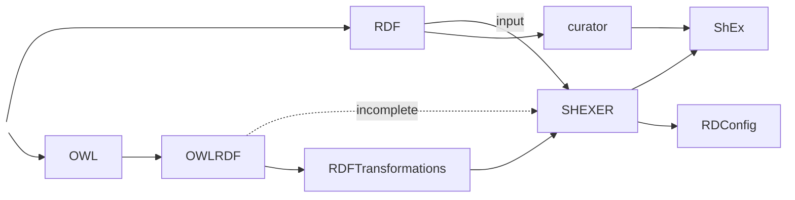

# RDFlow
Demonstrator framework for automatic RDF schema extraction and documentation with rdf-config, paving the way for continuous schema evaluation

```mermaid
flowchart LR
    R[RDF] 
    O[OWL]
    SR[SHEXER]
    RDC[RDConfig]
    OR[OWLRDF]
    RT[RDFTransformations]
    curator[curator]

    %% Keep RDF and OWL visually aligned by linking them to an invisible dummy
    start(( )):::hidden
    start --> R
    start --> O

    R -->|input| SR 
    O --> OR
    OR -. incomplete .-> SR
    OR --> RT
    RT --> SR
    SR --> ShEx 
    SR --> RDC
 
    R --> curator
    curator --> ShEx

    classDef hidden display:none;
```
